# localHttps
本地搭建 ip + https（目前支持firefox+chrome+ie）


cd 到本目录
执行 ./mkcert.sh
输入密码时都输空就ok.

执行完命令后，在out目录下会生成需要的ca证书和服务器证书  
其中：  
ca.key  ca证书的key  
ca.crt  ca证书  
server.key 服务端key  
server.crt 服务端crt  
server.req 生成服务端crt的请求文件，忽略  

目前该程序经测试，在chrome67下ok.

另外：
127.0.0.1 是始终允许的  
localhost, 本地实际ip访问（需要修改conf/local.ext中的ip才能支持）

下面以apache安装为例：
```
Listen 4433
<VirtualHost  *:4433>
    SSLEngine on
    SSLCertificateFile "${SRVROOT}/conf/ssl/testHttps/server.crt"
    SSLCertificateKeyFile "${SRVROOT}/conf/ssl/testHttps/server.key"
    DocumentRoot "E:/testHttps"
    <Directory "E:/testHttps">
        Options Indexes FollowSymLinks Includes ExecCGI
        AllowOverride all
        Require all granted
    </Directory>
</VirtualHost>
```

其中server.crt, server.key就是通过mkcert.sh生成的证书文件

对于chrome,添加根证书操作如下：  
win+r certmgr.msc  
证书-->受信任的根证书颁发机构 右键：所有任务，导入ca.crt,见下图  

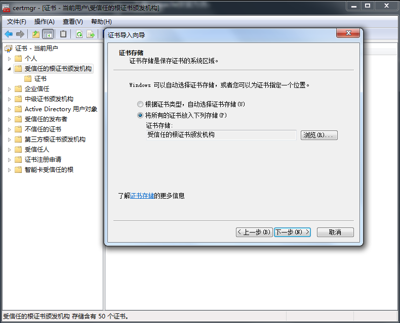
测试ip+https结果如下：
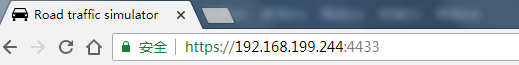
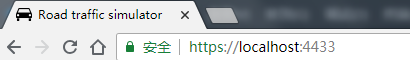
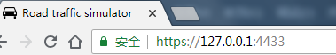

对于firefox，添加根证书的操作如下：  
选项-->搜索证书->查看证书-->证书颁发机构，导入ca.crt,具体见下图  

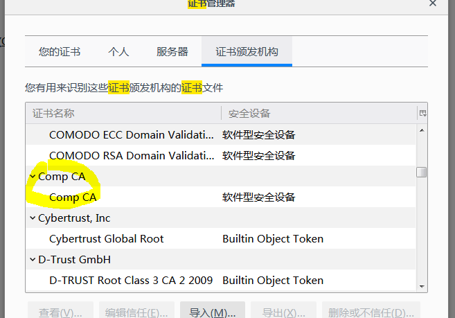
测试ip+https结果如下：
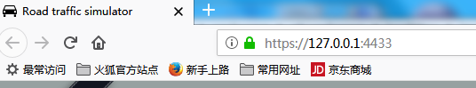
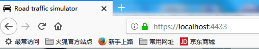
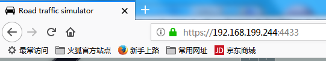

对于IE，添加根证书的操作如下：  
Internet选项-->内容-->受信任的根证书颁发机构-->证书，导入ca.crt，见下图

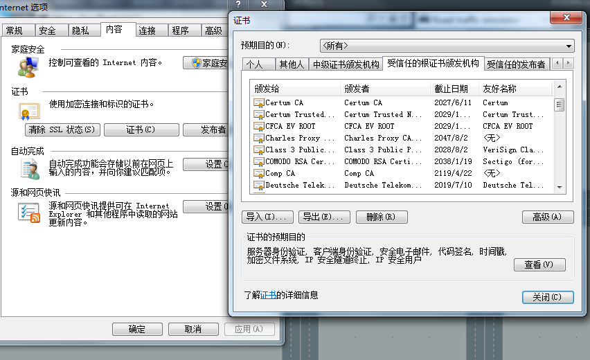
测试ip+https结果如下：
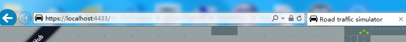
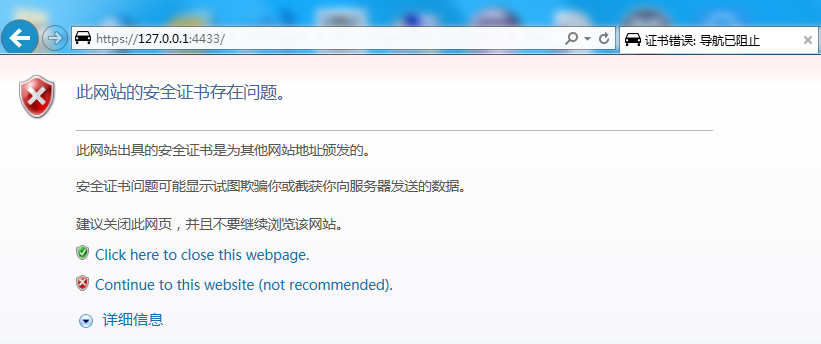
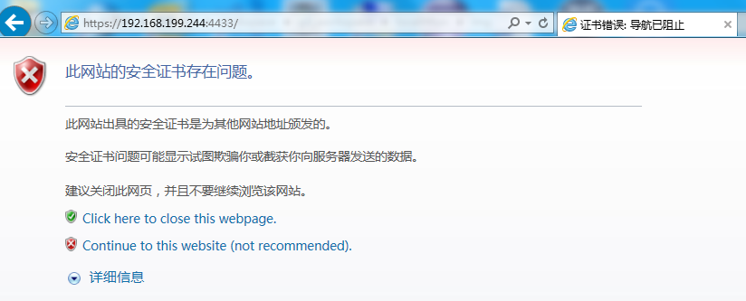


